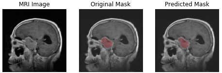
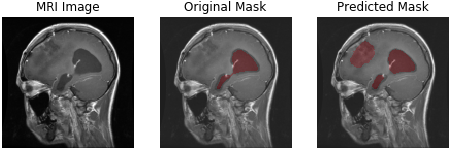
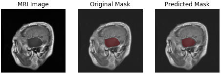
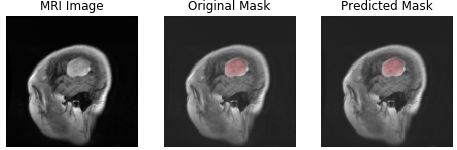
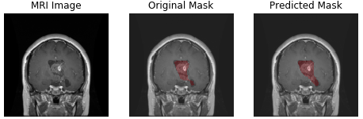
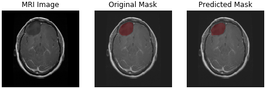
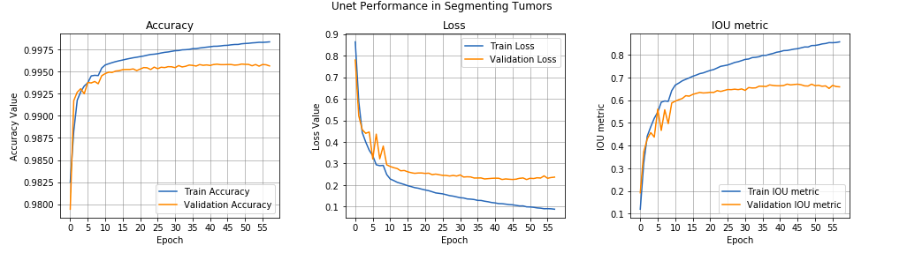
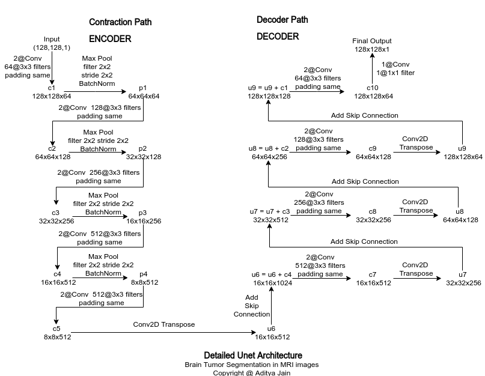

# Brain tumor MRI images segmentation using U-Net

There are 3 types of brain tumor:
1. meningioma
2. glioma
3. pituitary tumor

## Examples of predicted tumor segment by the current U-Net implementation.
meningioma       	  | glioma		| 	pituitary tumor             
:-------------------------:|:-------------------------:|:------------------------:
  |  		| 
  |  		|  
  |  		|  

## Getting Started
For an intreactive session and quick start, start with this notebook. [notebook](https://github.com/deviprasad97/MRI-segmentation-using-UNet/blob/master/brain_tumor_segmentation.ipynb).

### Prerequisites
The code requires python 3.6+ and all the needed packages are listed in requirements.txt. To install all needed libraires run following command:
```console
pip install -r requirements.txt
```

### Geting the Dataset
Dataset used for this experiment is publically avalible. Easiest way to recreate the dataset dir tree use [download_data.sh](https://github.com/deviprasad97/MRI-segmentation-using-UNet/blob/master/download_data.sh) this bash script will download dataset and create all necessary folder. At the end you will have 3064 MRI images and 3064 masks. 
```console
sh download_data.sh
```
Now we will need to convert matlab data files into numpy file that we can use in our python code. Run following command:
```console
python mat_to_numpy.py brain_tumor_dataset/ 
```

## Model Architecture
I have used Resnet 101 with combination of multiple losses which includes binary crossentropy, dice loss with equal weightage. Also I have used Conv2D transpose layers for upsampling. 

I have used the metric called IOU (Intersection over Union) metric to track progress of training and trained Unet with Adam optimizer for 40-60 epochs with decaying learning rate between 1e-3 to 1e-4. I have also performed only one Image augmentation i.e. horizontal flip. Train and test split was stratified using type of tumor.

I have used image augmentation like vertical flip, brightness, zoom etc.




Detailed architecure is given below.


## Possible Improvements
1. Include lovasz loss with higher weightage.
2. Learn and use Hypercolumns

## Author:
* Devi Prasad Tripathy : [Portfolio](http://deviprasadtripathy.com)